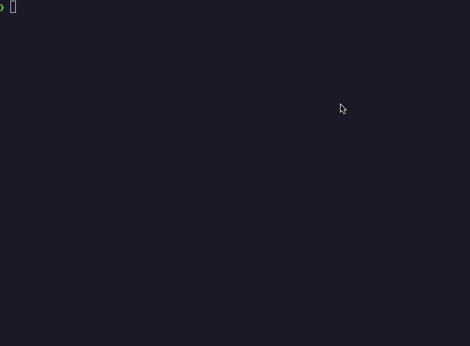

# Chat

A simple natural language to shell command translator using Ollama with an LLM.

Currently it supports only zsh and MacOS.

## Demo



## Pre-requisites

[Ollama must be installed](https://ollama.com/) and up and running.
Run Ollama in the background:

```zsh
ollama serve &

# next command is only necessary once
ollama pull <llm_model_name> 
```

## Build and Run

Build the project by running:

```zsh
cargo build --release
```

Run the chat from cargo:

```zsh
cargo run
```

Install the chatbot by placing the binary from `target/release/chat` in your path.

## Usage

For now the chat is a simple terminal chatbot.
You can chat with it by running:

```zsh
chat
```

## Future Work

- Add a non-interactive mode and execute the commands directly
- Add chat history
- Add a feature which explains the generated command
- Make it configurable to use different LLMs
- Make it configurable to support different additional tools installed on the machine
- Add support for more shells
- Add support for other OSs

## Know Issues

These are known issue and will be fixed in the future:

- Sometimes the model will not return only the command but also some explanation.
- Very complex workflows might fail to generate the correct command.
